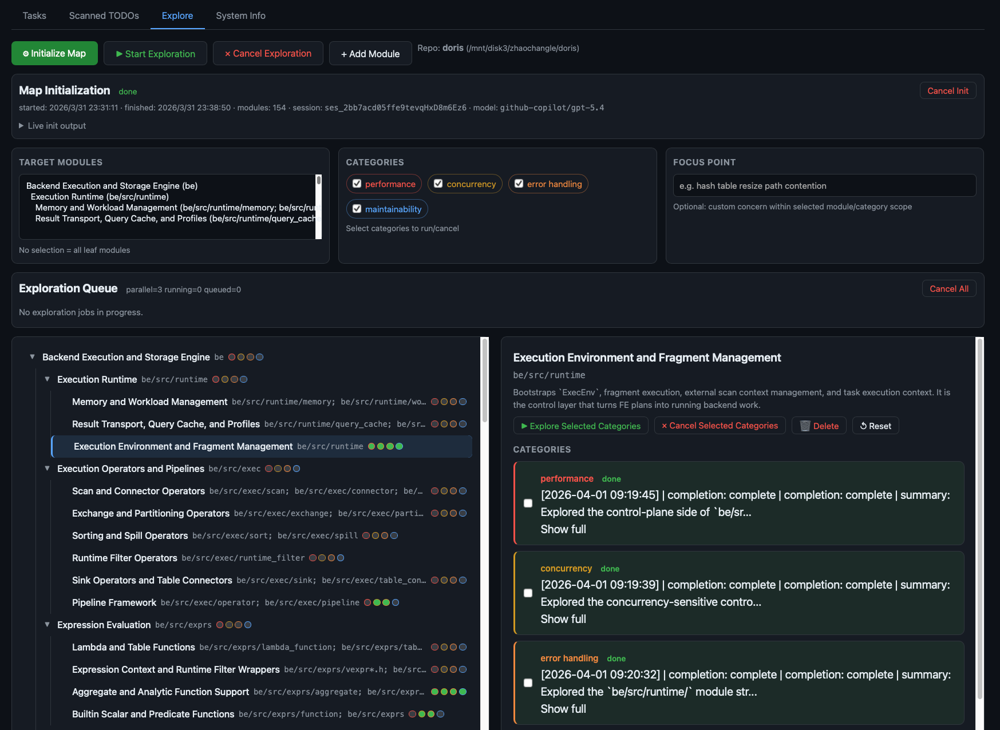
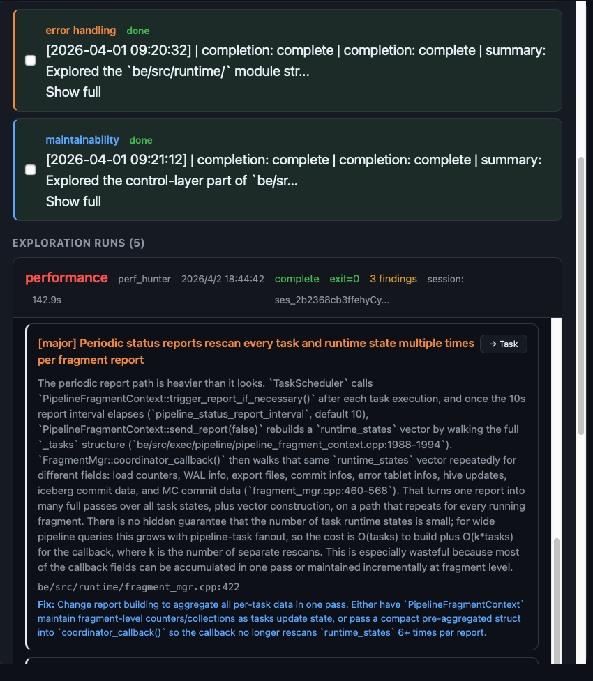

# Multi-Agent TODO Resolver

A persistent, daemon-based multi-agent system that leverages [opencode](https://opencode.ai) to **automatically explore, discover, plan, implement, and review code changes** across a codebase. Multiple tasks run in parallel, each in its own `git worktree`, driven by a **Project Explorer** and a **Planner → Coder → Reviewer** pipeline with configurable models and retry logic.

## Why This Project?

Tools like **Cursor** and **opencode** are powerful single-task coding assistants, but they operate in a single conversation at a time — you drive each interaction manually, and parallelism requires you to manage multiple terminal windows or editor tabs yourself. This project fills a different niche:

- **Batch autonomy** — Submit multiple tasks (or let the system discover them from TODO comments) and walk away. The daemon plans, codes, and reviews them concurrently without human babysitting.
- **Continuous project exploration** — Set up a free-running Explorer agent that continuously reads your codebase, understands the project structure, and proactively identifies potential refactors, bugs, or missing features.
- **Built-in quality gate** — Every code change is reviewed by one or more AI reviewers before it's considered done. Failed reviews automatically trigger retries with the reviewer's feedback, creating a self-correcting loop that a single-assistant workflow can't provide.
- **Persistent state** — Tasks, agent runs, and review history are stored in SQLite. You can stop the daemon, reboot, and resume exactly where you left off. Cursor/opencode sessions are ephemeral.
- **Repository-scale isolation** — Each task runs in its own git worktree and branch, so parallel tasks never conflict. Publishing is a one-click push.

In short: Cursor and opencode are excellent *interactive copilots*; this project is an *autonomous task queue* that orchestrates them at scale.

## Key Features

- **Continuous Project Explorer** *(New!)* — A free-running agent loop that continuously explores the codebase to understand the overarching structure and business logic. It autonomously identifies potential architectural improvements, hidden bugs, and missing tests without requiring explicit TODO comments.
- **Automatic TODO Discovery** — Scans a repository for `TODO`/`FIXME` comments, then uses an AI analyzer to score each by feasibility and difficulty, producing a prioritized backlog.
- **Plan → Code → Review Loop** — Each task goes through a planner (generates an implementation plan), a coder (writes code in an isolated worktree), and one or more reviewers (approve or request changes). Rejected code re-enters the loop automatically.
- **Multi-Model, Multi-Reviewer** — Assign different models by task complexity (e.g. Opus for hard tasks, Haiku for simple ones). Multiple reviewer models vote; **all** must approve for a task to pass.
- **Parallel Execution** — Tasks run concurrently in separate `git worktree` branches, up to a configurable limit.
- **Human-in-the-Loop** — Completed or failed tasks can be *revised* with manual feedback, re-entering the code→review loop. A dedicated *review-only* mode lets you submit patches or PRs for AI review without any code generation.
- **Web Dashboard** — Real-time dark-themed UI for task management, agent run inspection, TODO browsing, model configuration, and branch publishing.
- **Runtime Model Editing** — Change planner/coder/reviewer models from the dashboard at any time; changes persist to `config.yaml`.
- **Resource Lifecycle** — Worktrees and branches are automatically cleaned up when review-only tasks complete, tasks are cancelled, or via a manual "Clean" action.

## Screenshots

### Project Explorer — Continuous Analysis Loop

The Explorer agent continuously crawls the codebase, mapping out dependencies, identifying technical debt, and proposing new tasks without needing explicit TODO markers.





These tasks will be automatically prioritized and become tasks ready to be launched.

### Agent Runs — Code → Review Loop

Each task cycles through coder and reviewer agents. Reviewer verdicts (**APPROVE** / **REQUEST_CHANGES**) are displayed inline. The coder retries with the reviewer's feedback until all reviewers approve or retries are exhausted.


### Scanned TODOs — AI-Analyzed Backlog

TODOs are scanned from the repo, then analyzed by an AI model that scores **feasibility** and **difficulty**, and writes a detailed analysis note. You can selectively dispatch them as tasks.


## Architecture

```
                         ┌──────────────────────────────────┐
                         │          Web Dashboard           │
                         │  (FastAPI, single-file HTML/JS)  │
                         └──────────┬───────────────────────┘
                                    │ REST API
                                    ▼
┌───────────────────────────────────────────────────────────────────┐
│                          Orchestrator                             │
│                                                                   │
│  Task Queue (SQLite)  ·  Parallel Dispatch  ·  Retry Logic        │
│  Project Explorer     ·  TODO Scanning       ·  Worktree Lifecycle│
└──────┬──────────────────────┬──────────────────────┬──────────────┘
       │                      │                      │
       ▼                      ▼                      ▼
┌─────────────┐     ┌─────────────┐     ┌──────────────────────┐
│  Explorer & │     │    Coder    │     │  Reviewer(s)         │
│  Planner    │     │    Agent    │     │  (N models, all must │
│  Agents     │     │  (per-      │     │   approve)           │
│ complexity  │     │  complexity)│     └──────────────────────┘
│ assessment  │     │             │
│ + sub-task  │     │ git worktree│
│   splitting │     │ isolation   │
└─────────────┘     └─────────────┘
       │                   │                    │
       └───────────────────┴────────────────────┘
                           │
                    opencode CLI
                  (any LLM backend)
```

## Task Pipeline

```
Explorer discovers task / User submits task / TODO dispatched
        │
        ▼
   ┌─────────┐  Assesses complexity, may split into sub-tasks
   │ PLANNING│──────────────────────────────────────────────┐
   └────┬────┘                                              │
        │                                          sub-tasks dispatched
        ▼                                          independently
   git worktree created (agent/task-<id>-<slug>)
        │
        ▼  ◄─── retry loop (up to max_retries) ───┐
   ┌─────────┐                                     │
   │ CODING  │  Coder implements in worktree       │
   └────┬────┘                                     │
        │                                          │
        ▼                                          │
   ┌──────────┐                                    │
   │ REVIEWING│  All reviewers vote                │
   └────┬─────┘                                    │
        │                                          │
        ├── All APPROVE ──▶ COMPLETED              │
        │                                          │
        └── Any REQUEST_CHANGES ───────────────────┘
                                    (feedback fed back to coder)
            After max retries ──▶ FAILED
```

Completed tasks can be **published** (push branch to remote), **revised** (human sends feedback, loop resumes), or **cleaned** (worktree + branch deleted).

## Quick Start

### Prerequisites

- Python 3.11+
- [opencode](https://opencode.ai) CLI installed and configured with at least one model provider
- A git repository to work on

### Setup

```bash
# Clone this project
git clone <repo-url> multi-agent-todo
cd multi-agent-todo

# Install dependencies
pip install -r requirements.txt

# Copy and edit config
cp config.yaml.template config.yaml
# Edit config.yaml — set repo.path, model names, etc.

# Start the daemon
python cli.py start

# Open the dashboard
# http://localhost:8778
```

## CLI Reference

```bash
# Daemon
python cli.py start [--foreground]          # Start daemon (background or foreground)
python cli.py stop                          # Stop daemon
python cli.py status                        # Show system status

# Tasks
python cli.py add -t "Fix bug X" -d "..."  # Submit a task
python cli.py list [--status pending]       # List tasks
python cli.py show <task_id> [--json]       # Show task details
python cli.py dispatch <task_id|all>        # Dispatch pending task(s)
python cli.py cancel <task_id>              # Cancel a running task

# TODO Management
python cli.py scan [--limit 50]             # Scan repo for TODO/FIXME comments
python cli.py todos list                    # List scanned items with scores
python cli.py todos analyze [id ...]        # AI-analyze feasibility & difficulty
python cli.py todos dispatch id1 id2 ...    # Send to planner as tasks
python cli.py todos delete id1 id2 ...      # Remove TODO items

# Testing
python cli.py run-one -t "Title" -d "..."   # Run one task synchronously
```

## Web Dashboard

Access at `http://<host>:<port>` (default `http://localhost:8778`). Main tabs include:

| Tab | Features |
|---|---|
| **Explorer** | Real-time view of the continuous Explorer loop. See the current area of the codebase being analyzed, recent insights discovered, and automatically proposed tasks. |
| **Tasks** | Task list with status badges, complexity indicators, sub-task hierarchy. Inline actions: Run, Publish, Cancel, Clean. Click a task for the detail modal with tabs for Overview, Sessions, Agent Runs, Git Status, and Outputs. |
| **Scanned TODOs** | Browse scanned TODO items. Bulk actions: Scan, Analyze, Send to Planner, Revert, Delete. Each item shows file location, description, feasibility/difficulty scores, and AI analysis notes. |
| **System Info** | Live view of orchestrator config. Edit planner/coder/reviewer/explorer models via dropdowns (populated from `opencode models`). Changes persist to `config.yaml` immediately. |

## Configuration

See [`config.yaml.template`](config.yaml.template) for a full annotated template. Key sections:

| Section | Purpose |
|---|---|
| `repo` | Target repository path, base branch, worktree directory, setup hook scripts |
| `opencode` | Model assignments (planner, coder by complexity, reviewers), timeout |
| `orchestrator` | Max parallel tasks, retry count, poll interval, auto-scan toggle |
| `web` | Dashboard host and port |
| `publish` | Git remote for pushing completed branches |
| `hook_env` | Environment variables injected into worktree hook scripts |

## Testing

The project uses [pytest](https://pytest.org) with tests in `tests/`. All model I/O is mocked — tests are fast and need no external services.

```bash
# Run all tests
python -m pytest tests/ -v

# Run a specific test module
python -m pytest tests/test_dep_tracker.py -v

# Run with short summary
python -m pytest tests/ --tb=short
```

## Adapting to Another Repository

The system is **repository-agnostic**. To point it at a different codebase:

1. Set `repo.path` to the target repo's absolute path.
2. Set `repo.base_branch` to the branch worktrees should be based on.
3. Optionally configure `repo.worktree_hooks` to run setup scripts (e.g. build `compile_commands.json`, install deps) in each new worktree.

No changes to agent code are needed — `opencode` provides the codebase understanding.
